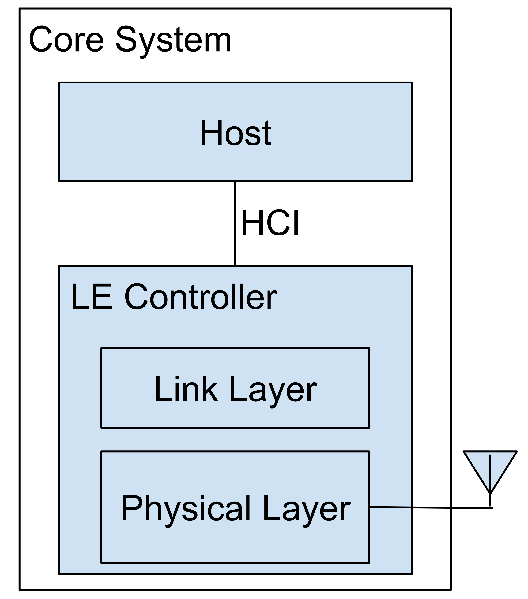
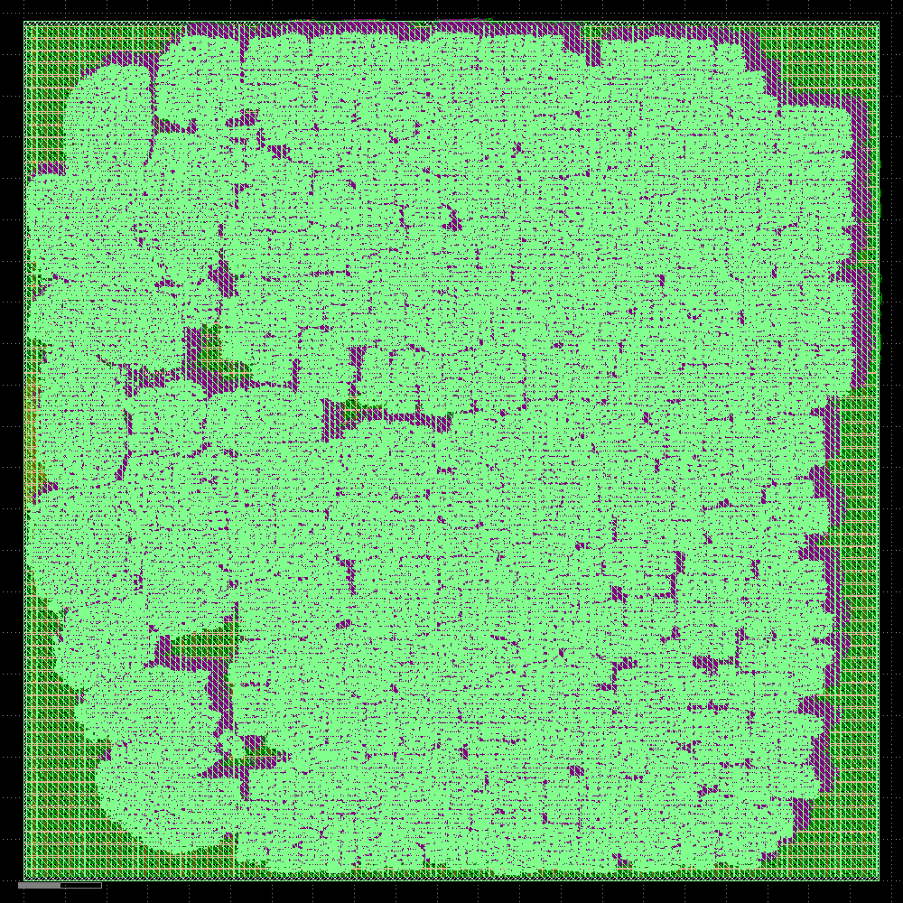

<!--
Author: Xianjun Jiao <putaoshu@msn.com>
SPDX-FileCopyrightText: 2024 Xianjun Jiao
SPDX-License-Identifier: Apache-2.0 license
-->

# The open-source BTLE (Bluetooth Low Energy) baseband chip design

This is an open-source Bluetooth Low Energy controller (baseband part) project written in Verilog: https://github.com/JiaoXianjun/BTLE/tree/vlsi24-code-a-chip/verilog

There is also a Python bit-true algorithm model for the Verilog project: https://github.com/JiaoXianjun/BTLE/tree/vlsi24-code-a-chip/python

[open_btle_baseband_chip.ipynb](open_btle_baseband_chip.ipynb) has the most complete/comprehensive information. Download and open it in Google Colab to read and run Python/Verilog simulation, synthesis, mapping, routing, etc., with OpenLane2 workflow targeting SkyWater 130 PDK and Xilinx Vivado targeting FPGA.

Here are some quick pieces to get you some basic ideas about the project.

- [[The main features and innovative points](#The-main-features-and-innovative-points)]
- [[The main references contributing to this project](#The-main-references-contributing-to-this-project)]
- [[The main contents of the Python notebook](#The-main-contents-of-the-Python-notebook)]
- [[The top architecture and the BTLE chip refers to the LE controller](#The-top-architecture-and-the-BTLE-chip-refers-to-the-LE-controller)]
- [[The LE controller principle and the scope of this project](#The-LE-controller-principle-and-the-scope-of-this-project)]
- [[The example of the waveform during the Python and Verilog simulation](#The-example-of-the-waveform-during-the-Python-and-Verilog-simulation)]
- [[The result of the Xilinx Zynq 7z020 FPGA target](#The-result-of-the-Xilinx-Zynq-7z020-FPGA-target)]
- [[The GDSII of the btle rx core](#The-GDSII-of-the-btle-rx-core)]
- [[The Detailed Placement and CTS of the whole project](#The-Detailed-Placement-and-CTS-of-the-whole-project)]

## The main features and innovative points
- Sub set of [BTLE core spec v5.3](https://www.bluetooth.org/DocMan/handlers/DownloadDoc.ashx?doc_id=521059)
  - LE 1M, with uncoded data at 1 Mb/s
  - GFSK (Gaussian Frequency Shift Keying) with BT(Bandwidth-bit period product)=0.5
  - Modulation index 0.5
  - Preamble has 1 octet
  - Access address has 4 octets
  - PDU (Protocol Data Unit) has 2-39 octets
  - CRC (Cyclic Redundancy Check) has 3 octets
- BER (Bit Error Rate) performance
  - With max 50PPM clock error, BER 0.1% @ 24.5dB SNR
  - With 20PPM clock error, BER 0.1% @ 11.5dB SNR
- Configurable gauss filter taps -- Flexible bandwidth/spectrum-shape
  - Support non-standard BT value or other phase smoothing strategy, such as GMSK (Gaussian Minimum Shift Keying).
- Configurable COS and SIN table -- Flexible modulation index
  - Support non-standard frequency deviation
- 16MHz main clock speed. 8x oversampling in both transmitter and receiver
  - oversampling rate is customizable in design time

## The main references contributing to this project

Link|Role
----|----
https://www.bluetooth.com/specifications/specs/core-specification-5-3/|Core Specification 5.3 is the main reference. Mainly PartA&B of Vol6: Low Energy Controller
https://github.com/JiaoXianjun/BTLE|The starting point of this project. Created ~10 years ago by me. The new design files are in BTLE/python and BTLE/verilog directories
https://colab.research.google.com/github/efabless/openlane2/blob/main/notebook.ipynb|The OpenLane2 work flow I learnt/copied
https://github.com/halftop/Interface-Protocol-in-Verilog|general_uart is used for HCI (Host Controller Interface)
https://github.com/KennethWilke/sv-dpram|Dual port ram (modified in this project) IP
https://public.ccsds.org/Pubs/413x0g3e1.pdf|Figure 3-3: GMSK Using a Quadrature Modulator -- The GFSK modulation method adopted in this project
https://research.utwente.nl/en/publications/bluetooth-demodulation-algorithms-and-their-performance|Fig. 6. Phase-shift discriminator -- The GFSK demodulation method adopted in this project

## The main contents of the Python notebook
- **BTLE chip architecture**
- **The overall design and implementation methodology**
- **Prior arts analysis**
- **Introduction of the reference SDR BTLE project and its users**
- **Basic principle of BTLE algorithm and structure of the project files**
- **Align the Python algorithms to the SDR BTLE project**
- **Use Python script to evaluate BER under different clock error**
- **Use Python script and Verilog testbench to simulate the design**
- **Synthesis and Implementation for Xilinx FPGA**
- **Run through OpenLane2 SKY130 PDK flow to generate GDSII**

## The top architecture and the BTLE chip refers to the LE controller

## The LE controller principle and the scope of this project

## The example of the waveform during the Python and Verilog simulation

## The result of the Xilinx Zynq 7z020 FPGA target

## The GDSII of the btle rx core

Note: Static Timing Analysis (Post-PnR) failed

## The Detailed Placement and CTS of the whole project

Note: Global Routing failed

