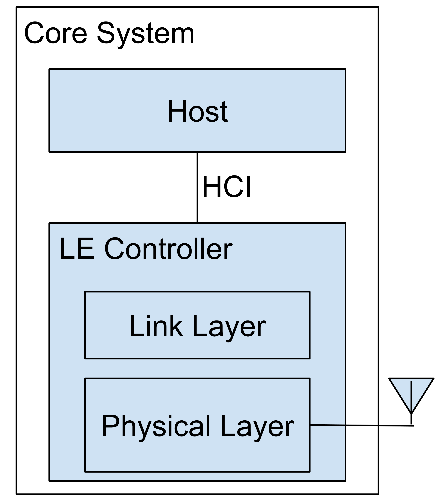
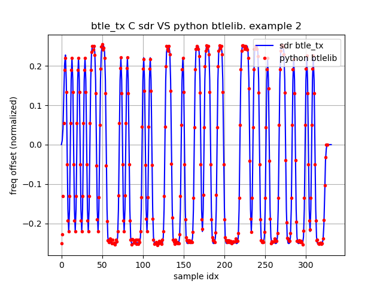
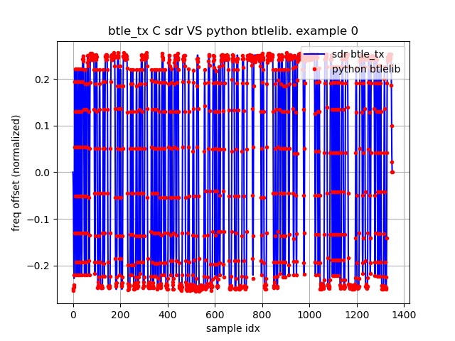
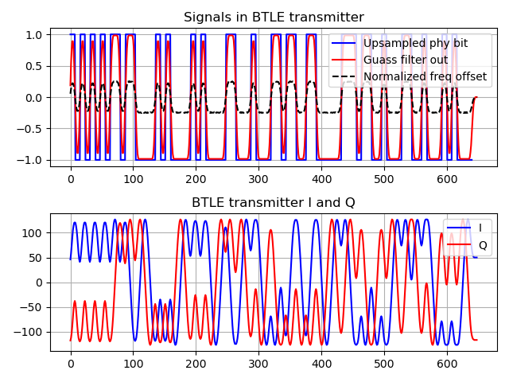
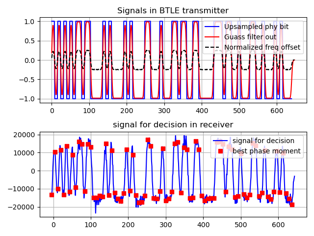
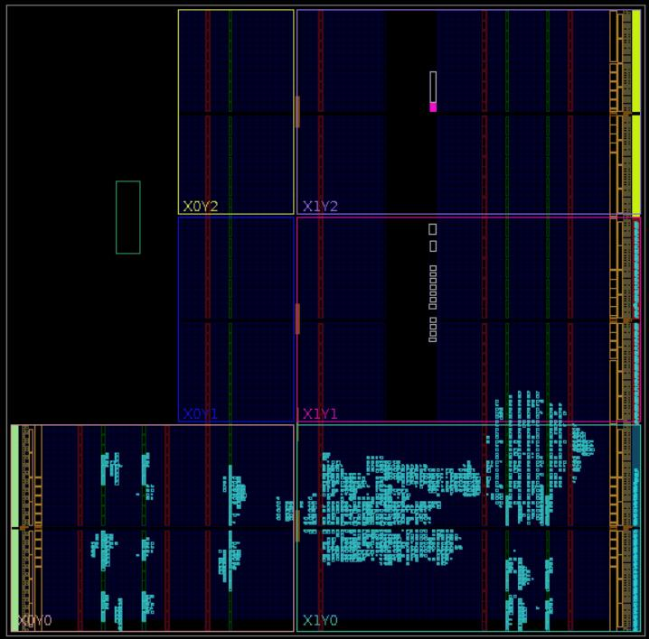
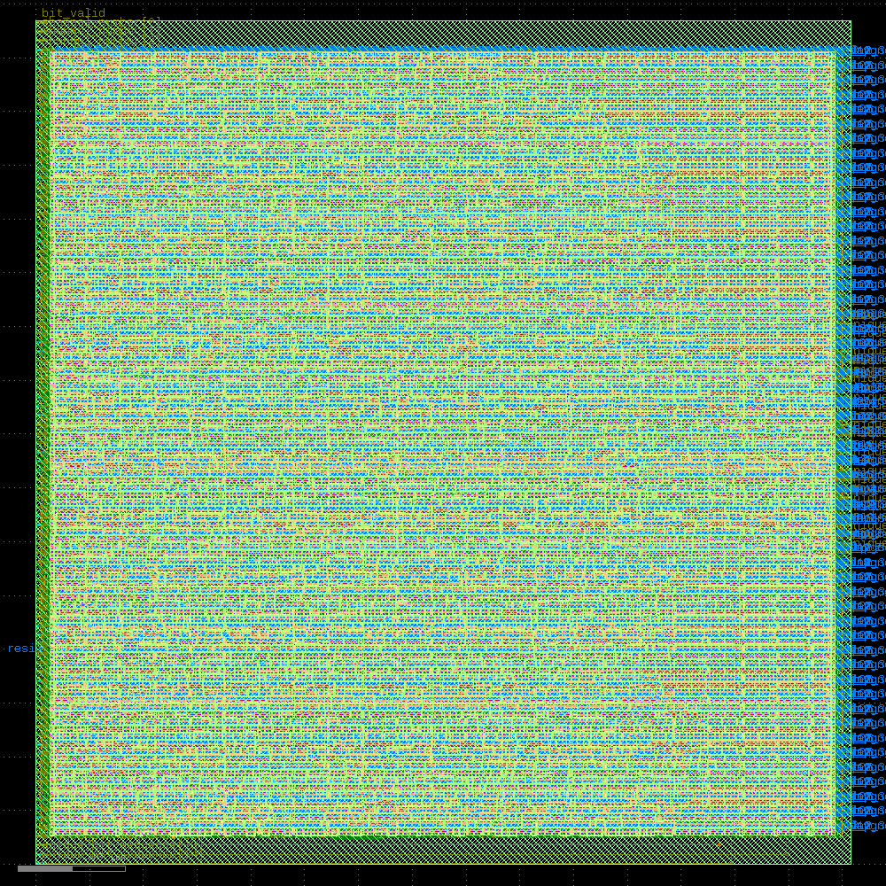
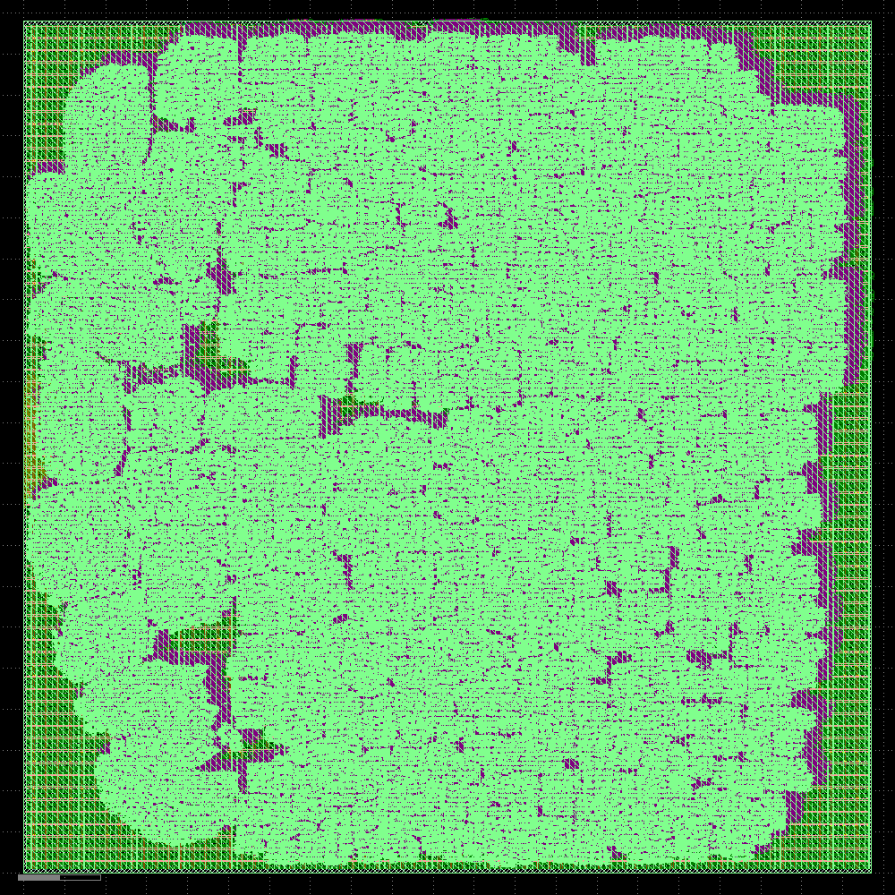

# **The open-source BTLE (Bluetooth Low Energy) baseband chip design**

Xianjun Jiao, 2024.

SPDX-FileCopyrightText: 2024 Xianjun Jiao

SPDX-License-Identifier: Apache-2.0 license

- [[Summary of reference projects and papers](#Summary-of-reference-projects-and-papers)]
- [[Summary of the version of main packages](#Summary-of-the-version-of-main-packages)]
- [[BTLE chip architecture](#BTLE-chip-architecture)]
- [[The overall design and implementation methodology](#The-overall-design-and-implementation-methodology)]
- [[Prior arts analysis](#Prior-arts-analysis)]
- [[Introduction of the reference SDR BTLE project and its users](#Introduction-of-the-reference-SDR-BTLE-project-and-its-users)]
- [[Basic principle of BTLE algorithm and structure of the project files](#Basic-principle-of-BTLE-algorithm-and-structure-of-the-project-files)]
- [[Align the Python algorithms to the SDR BTLE project](#Align-the-Python-algorithms-to-the-SDR-BTLE-project)]
- [[Use Python script to evaluate BER under different clock error](#Use-Python-script-to-evaluate-BER-under-different-clock-error)]
- [[Use Python script and Verilog testbench to simulate the design](#Use-Python-script-and-Verilog-testbench-to-simulate-the-design)]
- [[Synthesis and Implementation for Xilinx FPGA](#Synthesis-and-Implementation-for-Xilinx-FPGA)]
- [[Run through OpenLane2 SKY130 PDK flow to generate GDSII](#Run-through-OpenLane2-SKY130-PDK-flow-to-generate-GDSII)]

## Summary of reference projects and papers

Link|Role
----|----
https://www.bluetooth.com/specifications/specs/core-specification-5-3/|Core Specification 5.3 is the main reference. Mainly PartA&B of Vol6: Low Energy Controller
https://github.com/JiaoXianjun/BTLE|The starting point. Created ~10 years ago by me. The new design files are in BTLE/python and BTLE/verilog directories
https://colab.research.google.com/github/efabless/openlane2/blob/main/notebook.ipynb|The OpenLane2 work flow I learnt/copied
https://github.com/halftop/Interface-Protocol-in-Verilog|general_uart is used for HCI (Host Controller Interface)
https://github.com/KennethWilke/sv-dpram|Dual port ram in Verilog (modified in this project)
https://public.ccsds.org/Pubs/413x0g3e1.pdf|Figure 3-3: GMSK Using a Quadrature Modulator -- The GFSK modulation method adopted in this project
https://research.utwente.nl/en/publications/bluetooth-demodulation-algorithms-and-their-performance|Fig. 6. Phase-shift discriminator -- The GFSK demodulation method adopted in this project

## Summary of the version of main packages

|Packages|Version|
|--------|-------|
|Ubuntu | 22.04.4 LTS 64bit|
|libhackrf-dev | amd64/jammy 2021.03.1-2 uptodate|
|Icarus Verilog | version 12.0 (stable) (s20221226-498-g52d049b51)|
|cmake | version 3.22.1|
|build-essential | amd64/jammy 12.9ubuntu3 uptodate|
|Python | 3.10.12|
|numpy | Version: 1.21.5|
|matplotlib | Version: 3.5.1|
|BTLE commit | https://github.com/JiaoXianjun/BTLE/commit/ff4f2cf17e7a7cd91db6326edd24fa7128a5d945|
|Xilinx Vivado | 2021.1|
|openlane | 2.0.0rc2|
|sky130 PDK | bdc9412b3e468c102d01b7cf6337be06ec6e9c9a|

## Introduction

The open-source chip design is a hot topic in recent years. Across big companies to enthusiasts, lots of efforts have been put in multiple domains: high level instruction set definition (RISC-V), new HDL (Hardware Description Language, such as Chisel and SpinalHDL), open chip design (Rocket, BOOM), open EDA (Electronic Design Automation) tools (Yosys, OpenLane) and open PDK (Process Design Kit, such as SkyWater 130). These efforts inspired many active projects in the area of CPU (Central Processing Unit) and MCU (Micro Controller Unit) design. However open-source designs in the radio connectivity domain remain scarce. This project, the open-source BTLE (Bluetooth Low Energy) baseband chip design, aims to establish a foundational project in the domain of open radio connectivity chip design. Regarding the difference between this project and some prior arts, please find the prior art analysis section. As far as I know, this is the 1st open-source BTLE baseband project, that covers all modules from PDU to IQ sample, written in Verilog.

The main features and innovative points of this design are:
- Sub set of [BTLE core spec v5.3](https://www.bluetooth.com/specifications/specs/core-specification-5-3/)
  - LE 1M, with uncoded data at 1 Mb/s
  - GFSK (Gaussian Frequency Shift Keying) with BT(Bandwidth-bit period product)=0.5
  - Modulation index 0.5
  - Preamble has 1 octet
  - Access address has 4 octets
  - PDU (Protocol Data Unit) has 2-39 octets
  - CRC (Cyclic Redundancy Check) has 3 octets
- BER (Bit Error Rate) performance
  - With max 50PPM clock error, BER 0.1% @ 24.5dB SNR
  - With 20PPM clock error, BER 0.1% @ 11.5dB SNR
- Configurable gauss filter taps -- Flexible bandwidth/spectrum-shape
  - Support non-standard BT value or other phase smoothing strategy, such as GMSK (Gaussian Minimum Shift Keying).
- Configurable COS and SIN table -- Flexible modulation index
  - Support non-standard frequency deviation
- 16MHz main clock speed. 8x oversampling in both transmitter and receiver
  - oversampling rate is customizable in design time

The rest part of the document is organized into these sections:
- **BTLE chip architecture**
- **The overall design and implementation methodology**
- **Prior arts analysis**
- **Introduction of the reference SDR BTLE project and its users**
- **Basic principle of BTLE algorithm and structure of the project files**
- **Align the Python algorithms to the SDR BTLE project**
- **Use Python script to evaluate BER under different clock error**
- **Use Python script and Verilog testbench to simulate the design**
- **Synthesis and Implementation for Xilinx FPGA**
- **Run through OpenLane2 SKY130 PDK flow to generate GDSII**

## BTLE chip architecture

(It is assumed that the audiences already have basic knowledge of BTLE. If not, please check quickly the references in the SDR BTLE project: https://github.com/JiaoXianjun/BTLE/tree/master/doc)

Introduce what does the "BTLE chip" mean:
- [BTLE core spec v5.3](https://www.bluetooth.com/specifications/specs/core-specification-5-3/) Vol1 PartA Section2: "The Bluetooth Core system consists of a Host and a Controller".
- Vol4, HCI (Host Controller Interface) is defined over several options, such as UART (Universal Asynchronous Receiver-Transmitter), USB (Universal Serial Bus), etc.
- Vol6, the LE (Low Energy) Controller is composed of Physical Layer and Link Layer.
  - The Physical Layer is responsible for GFSK modulation/demodulation till RF (Radio Frequency) and antenna.
  - The Link Layer includes: packet composing/decomposing; control logic (protocol).
- In this project, BTLE chip refers to the LE controller.


This project implements the LE controller that has Physical Layer and Link Layer, except that:
- ADC(Analog to Digital Converter)
- DAC(Digital to Analog Converter)
- zero-IF (Intermediate Frequency) analog transceiver

In other words, this project focuses on the baseband part, not RF.

The control logic in the Link Layer and the HCI currently are dummy modules due to the limited development time. The dummy module is suitable to be implemented by a simple MCU, such as some RISC-V project.

## The overall design and implementation methodology

In this project the open BTLE baseband is implemented in Verilog. The baseband bit-true algorithm model is implemented and verified in Python. The Python scripts are also used to generate test vectors and reference results for Verilog modules. The Python algorithm is based on and aligned with the parent project: [BTLE -- The open-source SDR (Software Defined Radio) Bluetooth Low Energy](https://github.com/JiaoXianjun/BTLE), which was created by me about 10 years ago. The SDR BTLE project is written in C language and can communicate with the commercial BTLE devices (Phone, Pad, etc.) via SDR hardwares (HackRF, BladeRF). It works not only in the fixed frequency advertisement channel 37/38/39, but also can track the frequency hopping data channel traffic. This means the completeness of the protocol implementation is high in the reference SDR BTLE project. The Python scripts functionalities are aligned with the SDR BTLE project, so the Python scripts are trustworthy. The Verilog testbench takes the test vectors and the reference result vectors generated by Python scripts, and simulate the functionality of the whole design in iverilog, so the Verilog design's correctness is guaranteed. The SDR BTLE C program, the Python scripts and the Verilog testbench exchange the test vectors and reference results via files in the operating system. You will see this validation chain throughout this document later on.

## Prior arts analysis

- [Bluetooth Low Energy Baseband](https://github.com/tapeout/ble-baseband), **2018**, is a classroom project. It is written in Chisel, and only includes the bit level processing (scrambling and CRC) of the LE Link Layer. GFSK modulation and demodulation is not included. It is far from a complete LE baseband.

- [Low Power Bluetooth Baseband with a RISC-V Core for Autonomous Sensors using Chisel](https://repository.tudelft.nl/islandora/object/uuid%3A1380a830-61ef-4f4b-88c2-8a8fdff2a3d4), **2022-10-13**, is a master thesis work that writes some BTLE baseband functionalities in Chisel. Like the previous classroom project, this project also mainly implements the bit level processing (scrambling and CRC). GFSK modulation and demodulation is not included. It is far from a complete LE baseband.

- [A Bluetooth Low Energy Radio using FPGA SERDES: No ADC, AGC, filters, mixers, or amplifiers required.](https://github.com/newhouseb/onebitbt), **2021**, is the BTLE receiver and transmitter written in nmigen HDL. It has learnt and acknowledged my SDR BTLE project at the end of README. The main unique point of the project is implementing a kind of "Sigma Delta Modulation" with the high speed SERDES differential lines on the FPGA to create an ADC and DAC. It is a kind of experimental work mainly for demonstrating the unique idea of using FPGA SERDES as SDR radio frontend. The full support/testing of every corner of the BTLE protocol is not the main consideration. For example, it supports only fixed preamble and access address patterns for advertisement channels, and does not support the data channel packet transmission and reception. As a comparison, my SDR BTLE project targets to create a full/complete baseband that works not only for advertisement channels but also data channels. Not like the experimental SERDES idea, my project works with the mature zero-IF analog transceiver.

- [A Fully Synthesizable Bluetooth Baseband Module for a System-on-a-Chip](https://onlinelibrary.wiley.com/doi/pdf/10.4218/etrij.03.0303.0018), **2003**, ETRI Journal, Volume 25, Number 5, October 2003, is for Bluetooth instead of Bluetooth LE (BT classical and LE are different). The paper is only for result reporting, not open sourcing.

## Introduction of the reference SDR BTLE project and its users

The [SDR BTLE project](https://github.com/JiaoXianjun/BTLE) was created by me about 10 years ago. It implements the BTLE stack in C language and can communicate with the COTS (Commercial Off The Shelf) devices via SDR boards, such as HackRF and BladeRF. The capability includes not only advertisement packet processing in the fixed frequency channel but also data packet in the frequency hopping channels. Since it was created, it has been used in multiple projects and academic papers. This track record brings people confidence if it is the starting point of the open BTLE chip design.

Some example works that are based on my SDR BTLE project:

- [Bidirectional Bluetooth Backscatter With Edges](https://ieeexplore.ieee.org/document/10032655), **2024** IEEE Transactions on Mobile Computing (Volume: 23, Issue: 2, February 2024). In this work the SDR BTLE acts as a core module in the SDR edge server (with HackRF) to setup a bidirectional link between the BTLE reader and the BTLE backscatter tag.

- [Bluetooth Low Energy with Software-Defined Radio Proof-of-Concept and Performance Analysis](https://vbn.aau.dk/ws/portalfiles/portal/528271663/2023_CCNC.pdf), **2023** IEEE 20th Consumer Communications and Networking Conference (CCNC). In this work, the USB based SDR devices (such as HackRF, BladeRF) in the SDR BTLE project are replaced by PCIe based SDR devices to achieve the accurate IFS (Inter Frame Space) timing requirement of the BTLE standard. The BTLE stack on the host PC is based on the SDR BTLE project.

- [Tracking Anonymized Bluetooth Devices](https://people.bu.edu/staro/Tracking_Anonymized_Bluetooth_Devices__PoPETS_Camera_Ready_.pdf), **2019**, Proceedings on Privacy Enhancing Technologies. This work uses the SDR BTLE project to access the low level raw PHY bit of the BTLE packet, then discovers the vulnerability of BTLE MAC address randomization mechanism. The author says that normally some low level information/PHY-header are discarded by the ASIC/COTS BTLE chip, so SDR is a better choice for BTLE security research. The counter measure was also proposed.

- [Snout: A Middleware Platform for Software-Defined Radios](https://people.bu.edu/staro/IEEE_TNSM_Snout.pdf), **2023**, IEEE Transactions on Network and Service Management (Volume: 20, Issue: 1, March 2023). This paper implemented a middleware platform that supports many SDR programs and platforms. the btle_rx program (the receiver program in the SDR BTLE project package) is integrated as a receiver example.

- [Bluetooth Low Energy Receiver of portapack-mayhem](https://github.com/portapack-mayhem/mayhem-firmware/wiki/Bluetooth-Low-Energy-Receiver), **2023**. At the end of the page, it says Reference Code Used in Porting Protocol: https://github.com/JiaoXianjun/BTLE . The Portpack is a very popular "HAT" that can be integrated with HackRF SDR board, and run the SDR fully in embedded/hand-held style. The firmware has integrated lots of SDR applications. The BTLE application is based on my SDR BTLE project.

- [Unveiling IoT Vulnerabilities: Exploring Replay Attacks on BLE Devices](https://medium.com/@boluksadettin_77351/unveiling-iot-vulnerabilities-exploring-replay-attacks-on-ble-devices-e79ea85bbd31), **2024**. In this experiment, the btle_tx program (the transmitter program in the SDR BTLE project package) is used to generate the attack packet. The purpose is using the SDR device to pretend any other BTLE devices.

- [Security Fuzz Testing Framework for Bluetooth Low Energy Protocols](https://cccisa.ccisa.org.tw/article/view/2000/2007), **2019**, Communications of the CCISA, Regular Paper, (Vol 25, No 1, Feb 2019), TAIWAN. This paper integrates the btle_tx program for fuzzing (malformed) packet generation in their BTLE fuzzing test framework.

- [Bluetooth Security](https://link.springer.com/chapter/10.1007/978-981-10-8447-8_6), **2018**, Book Chapter, pp 195-226, First Online: 20 March 2018. In this chapter of the book "Inside Radio: An Attack and Defense Guide", the SDR BTLE project is introduced as a tool for security research.

## Basic principle of BTLE algorithm and structure of the project files

According to the section of "BTLE chip architecture", the BTLE chip actually refers to the LE controller. The controller is composed of two modules: Link Layer and Physical Layer. The following figure shows the big picture of BTLE operation principle, and involved modules with Verilog file name in blue (Python function names are similar). It also shows what is included in this project and what is not included. To check how each module work, please refer to seciont "Use Python script and Verilog testbench to simulate the design"


According to the standard, the Link Layer includes the control logic and packet composition/decomposition part. The Physical Layer does the GFSK modulation/demodulation till RF and antenna. The following further elaboration on the operation principle is based on the reference SDR BTLE project, the standard (core spec v5.3) and some other references. The principle is also shown in the above figure.

The packet composition, also called bit level processing, does the CRC24 calculation and pad the 3 CRC octets to the original PDU. Then scramble the PDU to get Physical Layer bits. Before sending it to GFSK modulation in Physical Layer, preamble (1 octet) and access address (4 octets) are padded before the scrambled PDU bit. According to the standard, the scrambling pattern and the preamble is related to the channel number. The CRC initial state and the access address are either fixed (advertisement channel) or negotiated with peers (data channel).

The Physical Layer GFSK modulation's principle could refer to the "Figure 3-3: GMSK Using a Quadrature Modulator" in [CCSDS 413.0-G-3](https://public.ccsds.org/Pubs/413x0g3e1.pdf). The basic idea of the implementation is that: bit 0 will drive the input address decrementing for the phase (COS and SIN) table to generate negative frequency deviation; bit 1 will drive the input address incrementing for the phase table to generate positive frequency deviation. The 0-1 transition smoothing is controlled by the coefficients of gauss filter, and this further shapes the spectrum. The max positive/negative frequency achieved is controlled by the waveform samples in the COS&SIN table. In this project, both gauss filter coefficients and COS&SIN table are configurable. This will help the design support multiple standards/purpose beyond BTLE.

The packet decomposition in the Link Layer at the receiver side does the inverse bit level processing of that in the transmitter. It is trivial.

The GFSK demodulation in the Physical Layer at the receiver side uses a simple Signal-to-Bit algorithm (digital baseband version of Fig.6 in https://research.utwente.nl/en/publications/bluetooth-demodulation-algorithms-and-their-performance):

`sign(i0*q1-i1*q0)`.

Where sign() means taking the sign of the result. Positive means 1, negative means 0. i0, q0, i1, q1 are input IQ samples at two successive sampling moments spaced by 1us (according to the LE 1M PHY in the standard)

Above actually detects whether the phase rotates clockwise or counter-clockwise between two successive IQ samples. It starts from:

`(i1+q1*j)*conj(i0+q0*j) = i1*i0+q1*q0+(i0*q1-i1*q0)*j`

It is easy to understand that the sign of the imaginary part `i0*q1-i1*q0` decides the rotation direction.

In our design, 8x oversampling is used in both transmitter and receiver. But the receiver does not know which one out of 8 sampling phases is the best after the signal experiences the circuit/channel propagation delay and the noise. So the receiver will do the GFSK demodulation and inverse bit level processing on all 8 sampling phases, and output the one that gives correct CRC checksum. The oversampling rate is also configurable.

In this project, the HCI UART interface between the controller Link Layer and the host is forked from https://github.com/halftop/Interface-Protocol-in-Verilog . The Link Layer control logic is temporarily a dummy module due to limited development time. In principle, the control logic module can be implemented by some simple RISC-V core.

The project includes two self explaining directories: **python** and **verilog**. The naming of those files are well aligned with the BTLE operation principle introduced above.

For Python files,
- **btlelib.py** has the top level transmitter function btle_tx and receiver function btle_rx. It also has all the sub-functions and some other helper functions, such as clock error emulation and AWGN (Additive White Gaussian Noise) channel.
- **btle_tx**'s subfunctions: crc24, crc24_core, scramble, scramble_core, gfsk_modulation_fixed_point, vco_fixed_point, etc.
- **btle_rx**'s subfunctions: gfsk_demodulation_fixed_point, search_unique_bit_sequence, scramble, scramble_core, crc24_core, etc.
- **test_alignment_with_btle_sdr.py** compares the signal generated by the Python transmitter (by calling btle_tx) and the signal generated by the SDR BTLE project.
- **test_btle_ber.py** simulates the BER vs SNR (Signal to Noise Ratio) under specified clock frequency error (max 50PPM according to the standard). It calls btle_tx, AWGN channel, cock error emulation, btle_rx, and runs many PDUs to get reliable BER statistics.
- **test_vector_for_btle_verilog.py** generates test vectors and the reference result vectors for Verilog testbench by using a similar script like test_btle_ber.py. The main difference is that it turns on the file saving flag.

For Verilog files,
- **btle_controller.v** is the top level module.
- **btle_controller.v** has Link Layer module btle_ll.v (with dummy control logic) and btle_phy.v, which actually include the Link Layer bit level processing and Physical Layer GFSK modulation and demodulation.
- **btle_phy.v** has btle_tx.v and btle_rx.v for transmitter and receiver respectively. btle_tx.v is matched to the btle_tx function in btlelib.py. btle_rx.v is matched to the btle_rx function in btlelib.py.
- **btle_tx.v** has submodules which are well aligned with the phython functions.
- **btle_rx.v** has 8 bele_rx_core.v instances via the "generate" method of Verilog to act as 8 parallel decoders working on 8 different sampling phases. Any of the 8 decoders has the correct CRC, the receiver will end working on the current packet. There is also a timeout logic to ensure the receiver will not work endlessly.
- **btle_rx_core.v** has submodules which are well aligned with the phython functions.
- module/submodule specific Verilog testbench file is module_name_tb.v.
- Though the top level module btle_controller.v has a UART interface, currently the UART is not used. The testbench btle_controller_tb.v uses the exposed raw Link Layer bit interface passing through the dummy Link Layer control logic.

## Align the Python algorithms to the SDR BTLE project

(If you don't like local installation, just upload and run **open_btle_baseband_chip.ipynb** in google colab. This readme is for local setup.)

Install necessary libs, download the open BTLE chip design (python and verilog directory) and build the reference SDR BTLE project.

```
sudo apt install libhackrf-dev
sudo apt install iverilog
git clone https://github.com/JiaoXianjun/BTLE.git
cd BTLE/host/
mkdir -p build
cd build/
cmake ../
make
```
You should see messages of successful builing like:
```
...
[ 75%] Building C object btle-tools/src/CMakeFiles/btle_rx.dir/btle_rx.c.o
[100%] Linking C executable btle_rx
[100%] Built target btle_rx
```

Run SDR BTLE project to generate IQ sample of a BTLE packet and save it to phy_sample.txt

```
cd ../../python/
../host/build/btle-tools/src/btle_tx 10-LL_DATA-AA-11850A1B-LLID-1-NESN-0-SN-0-MD-0-DATA-XX-CRCInit-123456
```

Do not worry about the failure due to lacking hardware.

Run **test_alignment_with_btle_sdr.py** to call Python algorithm generating IQ sample, then calculate realtime frequency offset for the SDR BTLE generated signal (phy_sample.txt) and the Python generated signal (by calling btle_tx in btlelib.py). Save the frequency offset result to btle_fo.txt and python_fo.txt for further plotting and comparison.

```
python test_alignment_with_btle_sdr.py 2
```

You should see outputs like:
```
argument: example_idx
2
Plese run firstly:
../host/build/btle-tools/src/btle_tx 10-LL_DATA-AA-11850A1B-LLID-1-NESN-0-SN-0-MD-0-DATA-XX-CRCInit-123456
```

and figure like:



Please noticed that "2" is given as argument to the script. It means the example index is 2. The Python script also gives hint of this example related btle_tx command line `../host/build/btle-tools/src/btle_tx 10-LL_DATA-AA-11850A1B-LLID-1-NESN-0-SN-0-MD-0-DATA-XX-CRCInit-123456`. This command has run before. Though hardware does not exist, the IQ sample is still generated and saved to phyt_sample.txt. The command also shows some information during the packet generation:
```
...
before crc24, pdu
0100
after crc24, pdu+crc
01009b8950
after scramble, pdu+crc
9bc14d4c14
...
```
The argument `10-LL_DATA-AA-11850A1B-LLID-1-NESN-0-SN-0-MD-0-DATA-XX-CRCInit-123456` given to btle_tx means that it is a data packet in channel 10 with access address 0x11850A1B and CRC initial state 0x123456. Regarding the exact meaning of the argument of btle_tx, please refer to the project README https://github.com/JiaoXianjun/BTLE/blob/master/README.md

If you open the test_alignment_with_btle_sdr.py and find out the initialization code for example 2, you will see
```
print('Plese run firstly:')
print('../host/build/btle-tools/src/btle_tx 10-LL_DATA-AA-11850A1B-LLID-1-NESN-0-SN-0-MD-0-DATA-XX-CRCInit-123456')
channel_number = 10 # from the 1st field in above btle_tx command argument
access_address = '1B0A8511' # due to byte order, the 11850A1B in above argument needs to be 1B0A8511
crc_state_init_hex = '123456' # from the CRCInit field in above btle_tx command argument
crc_state_init_bit = bl.hex_string_to_bit(crc_state_init_hex) # from the CRCInit field in above btle_tx command argument
pdu_bit_in_hex = '0100' # from the output of above btle_tx command
```
These are aligned with the argument and output of btle_tx program. This is the way of how SDR BTLE and phython take the same input. Only when the input are the same, comparison of the output is meaningful.

In the above figure the Python btlelib.py output (red) is well aligned with the SDR BTLE btle_tx output. The minor differences happen at the ramping up area (at the beginning) and the max frequency deviation area (around +/-0.25). It is due to the fact that the Python scripts use slightly different oversampling rate, gauss filter coefficients and COS&SIN table. But they both meet the BTLE standard requirements.

On page 2641 of the BTLE core spec v5.3, it says "The minimum frequency deviation shall never be less than 185 kHz when transmitting at 1 megasymbol per second (Msym/s) symbol rate". The above figure shows the normalized frequency offset with regards to 1Msym/s. The normalized frequency offset of 185kHz is 185KHz/1Msym/s = 0.185. In the figure, the max frequency deviation during each bit period is always bigger than 0.2 which is larger than the minimum requirement 0.185 in the standard.

Now let's run example 0 which has a longer packet in advertisement channel number 37.

```
../host/build/btle-tools/src/btle_tx 37-DISCOVERY-TxAdd-1-RxAdd-0-AdvA-010203040506-LOCAL_NAME09-SDR/Bluetooth/Low/Energy r500
```

Then run **test_alignment_with_btle_sdr.py** with example index 0 and compare the Python and SDR BTLE result. Again they are aligned.

```
python test_alignment_with_btle_sdr.py 0
```



## Use Python script to evaluate BER under different clock error

After we have verified Python btle_tx model/algorithm, the corresponding Python receiver algorithm is designed and implemented in btlelib.py. Please find the basic idea of the receiver algorithm in the section "Basic principle of BTLE algorithm and structure of the project files"

Then the next step is evaluating the BER (Bit Error Rate) performance of the receiver algorithm before going to the Verilog implementation. The BER performance is mainly affected by the AWGN noise, clock frequency error between the transmitter and the receiver. The multipath effect is not dominant here because the BTLE is basically a narrow band system. The related requirements in the standard (core spec v5.3) are listed:
- "3.1 MODULATION CHARACTERISTICS: The symbol timing accuracy shall be better than ±50 ppm."
- "4 RECEIVER CHARACTERISTICS: The reference sensitivity level referred to in this section is -70 dBm"
- "4.1 ACTUAL SENSITIVITY LEVEL: Maximum Supported Payload Length (bytes) 1 to 37, BER 0.1%. LE Uncoded PHYs, Sensitivity (dBm) <= -70"

For nowadays hardware quality, the above requirement is not tough. The crystal could reach PPM performance well below 50PPM easily. At -70dBm RSSI (Received Signal Strength Indicator) level, SNR could reach above 25dBm easily.

The Python script **test_btle_ber.py** constructs the simulation chain of btle_tx, AWGN channel and clock error emulation, btle_rx and BER statistics. It runs 300 packets with random content to achieve stable BER results. The packet has the maximum 37 octets in the PDU payload field, and 39 octets (2 octet header) in total for the PDU. It means `300*39*8 = 93600` bits passing through at each SNR point. There will be 93.6 error bits for BER 0.1%. Normally having around 100 error bits is regarded as sufficient.

Now let's run a worst 50PPM case by giving 50 as argument to the test_btle_ber.py, and plot the BER-SNR curve. It will take a while.

```
python test_btle_ber.py 50
```


During the simulation, some realtime info is shown: ppm value, frequency offset (50PPM --> 122.5KHz under 2.45GHz center frequency of 2.4GHz ISM band), BER and related the number of error bits, etc.

The figure shows that BER 0.1% is achieved around SNR 24.5dB, which is easy to have with RSSI -70dBm. This means the receiver algorithm meets the standard requirements on BER/sensitivity.

Let's simulate another better case: -30PPM.

```
python test_btle_ber.py -30
```    


From the above figure, BER 0.1% is achieved around SNR 13.5dB. In modern hardware, 30PPM is an easy task for a crystal, and it already can bring big gain on the sensitivity.

## Use Python script and Verilog testbench to simulate the design

Run **test_vector_for_btle_verilog.py** to generate test vectors and reference results into the verilog directory. The script also shows the input and output waveforms of some key Python/Verilog modules.

```
python test_vector_for_btle_verilog.py 2
```





In above example, "2" is input as argument to test_vector_for_btle_verilog.py. It is the same example index as introduced in the section "Align the Python scripts to the SDR BTLE project".

The full argument list for test_vector_for_btle_verilog.py is: `example_idx snr ppm_value num_sample_delay`. The name is self explained.

The figure shows that:
- The upsampled PHY bit (PDU bit after CRC and scramble), which is in blue squared NRZ waveform, is shown in the top figure.
- After the gauss filter, the PHY bit NRZ waveform is smoothed, and shown in red.
- Then the gauss filter output drives the GFSK modulator to generate the IQ (COS, SIN) sample which is shown as I (red) and Q (blue).
- The IQ sample related normalized frequency offset is shown in the dashed black curve in the top figure. It is well aligned with the PHY bit and gauss filter output waveform.
- The bottom figure shows the output of GFSK demodulator (algorithm: `sign(i0*q1 - i1*q0)`) in blue, and the best sampling phase (out of 8 possible phases) that gives correct CRC, in red square.

Now let's run the top level Verilog testbench btle_controller_tb.v which takes the Python transmitter input&output and the Python receiver input&output as test vectors.

```
cd ../verilog/
iverilog -o btle_controller_tb btle_controller_tb.v btle_controller.v btle_ll.v uart_frame_rx.v uart_frame_tx.v rx_clk_gen.v tx_clk_gen.v btle_phy.v btle_rx.v btle_rx_core.v gfsk_demodulation.v search_unique_bit_sequence.v scramble_core.v crc24_core.v serial_in_ram_out.v dpram.v btle_tx.v crc24.v scramble.v gfsk_modulation.v bit_repeat_upsample.v gauss_filter.v vco.v
vvp btle_controller_tb
```
You should see outputs like:
```
...
rx Save output to                                                   btle_rx_test_output.txt
rx crc_ok flag verilog 1 python 1
rx Test PASS.
rx compare the btle_rx_test_output_mem and the btle_rx_test_output_ref_mem ...
rx           0 difference found
TEST FINISH.
tx test_ok 1
rx test_ok 1
btle_controller_tb.v:605: $finish called at 391031250 (1ps)
```

Notice that the testbench also emulates the configuration behaviors (before sending packet) to show the runtime flexibility, such as writing the gauss filter coefficient memory and COS&SIN table, that were generated by Python scripts, into the related memory areas inside the controller.

The Verilog testbech btle_controller_tb.v compares the Verilog output with the reference Python output and gives PASS/FAIL indication at the end. From the above testbench output, the test result is PASS.

The testbench of almost all submodules, that compose the BTLE controller, are offered:
- crc24_tb.v
- scramble_tb.v
- bit_repeat_upsample_tb.v
- gauss_filter_tb.v
- vco_tb.v
- gfsk_demodulation_tb.v
- search_unique_bit_sequence_tb.v -- here the unique bit sequence is referring to the access address
- btle_rx_core_tb.v
- btle_tx_tb.v
- btle_rx_tb.v

At the beginning of each Verilog module_tb.v file, there are detailed instructions about how to generate the test vectors and run the testbench.

Some submodule testbench examples will be shown in the following part.

Run the CRC 24 testbench:

```
iverilog -o crc24_tb crc24_tb.v crc24.v crc24_core.v
vvp crc24_tb
```
Outputs:
```
VCD info: dumpfile crc24_tb.vcd opened for output.
WARNING: crc24_tb.v:46: $readmemh(btle_config.txt): Not enough words in the file for the requested range [0:31].
CRC_STATE_INIT_BIT 123456
Reading input from                                      btle_tx_crc24_test_input.txt
         56 read finish for test input.
Reading output ref from                                 btle_tx_crc24_test_output_ref.txt
         80 read finish for test output ref.
         56 input
        80 output
Save output to                                     btle_tx_crc24_test_output.txt
Compare the crc24_test_output_mem and the crc24_test_output_ref_mem ...
          0 error found! Test PASS.
crc24_tb.v:164: $finish called at 86406250 (1ps)
```
Above testbench shows that 24 bits are padded after the original packet, and the bits are equal to those generated by the Python scripts.

Run the testbench of VCO (Voltage Controlled Oscillator), which has the COS&SIN table as the last stage of GFSK modulator in the transmitter btle_tx:

```
iverilog -o vco_tb vco_tb.v vco.v dpram.v
vvp vco_tb
```
Outputs:
```
VCD info: dumpfile vco_tb.vcd opened for output.
        656 read finish for test input.
Reading output ref from                               btle_tx_vco_test_output_cos_ref.txt
        656 read finish for test output cos ref.
Reading output ref from                               btle_tx_vco_test_output_sin_ref.txt
        656 read finish for test output sin ref.
cos sin table initialized.
        656 input
       656 output
Save output cos to                                   btle_tx_vco_test_output_cos.txt
Save output sin to                                   btle_tx_vco_test_output_sin.txt
Compare the vco_test_output_cos_mem and the vco_test_output_cos_ref_mem ...
          0 error found! output cos Test PASS.
Compare the vco_test_output_sin_mem and the vco_test_output_sin_ref_mem ...
          0 error found! output sin Test PASS.
vco_tb.v:223: $finish called at 214218750 (1ps)
```

Run the full receiver btle_rx testbench:

```
iverilog -o btle_rx_tb btle_rx_tb.v btle_rx.v btle_rx_core.v gfsk_demodulation.v search_unique_bit_sequence.v scramble_core.v crc24_core.v serial_in_ram_out.v dpram.v
vvp btle_rx_tb
```
Outputs:
```
VCD info: dumpfile btle_rx_tb.vcd opened for output.
WARNING: btle_rx_tb.v:61: $readmemh(btle_config.txt): Not enough words in the file for the requested range [0:31].
CHANNEL_NUMBER 10
CRC_STATE_INIT_BIT 123456
ACCESS_ADDRESS 11850a1b
Reading input I from                                                  btle_rx_test_input_i.txt
        656 read finish for test input I.
Reading input Q from                                                  btle_rx_test_input_q.txt
        656 read finish for test input Q.
Reading output crc_ok ref from                                        btle_rx_test_output_crc_ok_ref.txt
          1 read finish from                                        btle_rx_test_output_crc_ok_ref.txt
Reading output ref from                                               btle_rx_test_output_ref.txt
          2 read finish from                                               btle_rx_test_output_ref.txt
ACCESS_ADDRESS 11850a1b detected
payload_length   0 octet
best_phase idx (among    8 samples) 4
crc_ok 1
        656 NUM_SAMPLE_INPUT
      1456 sample_in_count
Save output to                                                   btle_rx_test_output.txt
crc_ok flag verilog 1 python 1
Test PASS.
Compare the btle_rx_test_output_mem and the btle_rx_test_output_ref_mem ...
          0 difference found
btle_rx_tb.v:232: $finish called at 182406250 (1ps)
```

Run the gfsk_demodulation (part of the btle_rx receiver) testbench:

```
iverilog -o gfsk_demodulation_tb gfsk_demodulation_tb.v gfsk_demodulation.v
vvp gfsk_demodulation_tb
```
Outputs:
```
VCD info: dumpfile gfsk_demodulation_tb.vcd opened for output.
Reading input I from                                btle_rx_gfsk_demodulation_test_input_i.txt
         82 read finish for test input I.
Reading input Q from                                btle_rx_gfsk_demodulation_test_input_q.txt
         82 read finish for test input Q.
Reading output ref from         btle_rx_gfsk_demodulation_test_output_signal_for_decision_ref.txt
         81 read finish from         btle_rx_gfsk_demodulation_test_output_signal_for_decision_ref.txt
Reading output ref from                         btle_rx_gfsk_demodulation_test_output_bit_ref.txt
         81 read finish from                         btle_rx_gfsk_demodulation_test_output_bit_ref.txt
         82 input
        82 bit output
        82 signal for decision output
Save output bit to                             btle_rx_gfsk_demodulation_test_output_bit.txt
Save output signal for decision to             btle_rx_gfsk_demodulation_test_output_signal_for_decision.txt
Compare the gfsk_demodulation_test_output_bit_mem and the gfsk_demodulation_test_output_bit_ref_mem ...
          0 error found! output bit Test PASS.
Compare the gfsk_demodulation_test_output_signal_for_decision_mem and the gfsk_demodulation_test_output_signal_for_decision_ref_mem ...
          0 error found! output signal for decision Test PASS.
gfsk_demodulation_tb.v:199: $finish called at 112406250 (1ps)
```

Run the access address searching (part of the btle_rx receiver) testbench:

```
iverilog -o search_unique_bit_sequence_tb search_unique_bit_sequence_tb.v search_unique_bit_sequence.v
vvp search_unique_bit_sequence_tb
```
Outputs:
```
VCD info: dumpfile search_unique_bit_sequence_tb.vcd opened for output.
WARNING: search_unique_bit_sequence_tb.v:43: $readmemh(btle_config.txt): Not enough words in the file for the requested range [0:31].
ACCESS_ADDRESS 11850a1b
Reading input from                 btle_rx_search_unique_bit_sequence_test_input.txt
         81 read finish from                 btle_rx_search_unique_bit_sequence_test_input.txt
Reading output ref from            btle_rx_search_unique_bit_sequence_test_output_ref.txt
          1 read finish from            btle_rx_search_unique_bit_sequence_test_output_ref.txt
unique_bit_sequence full match at the         41th bit
unique_bit_sequence starting idx          9
Compare the unique_bit_sequence starting idx and the search_unique_bit_sequence_test_output_ref_mem[0] ...
Same as python result     9. Test PASS.
         81 input
search_unique_bit_sequence_tb.v:122: $finish called at 111406250 (1ps)
```
Above Verilog testbench shows that the access address is found at index 9 in the incoming IQ sample stream, and it is equal to the Python script test vector/result. Because the beginning 8 bits are preamble, the access address starts from the 9th bit. We can add 1 sample delay (8 in the oversampling domain) in the channel emulation part of the Python script, and run this access address search testbench again:

```
cd ../python/
python test_vector_for_btle_verilog.py 2 20 0 8

cd ../verilog/
iverilog -o search_unique_bit_sequence_tb search_unique_bit_sequence_tb.v search_unique_bit_sequence.v
vvp search_unique_bit_sequence_tb
```
Outputs:
```
VCD info: dumpfile search_unique_bit_sequence_tb.vcd opened for output.
WARNING: search_unique_bit_sequence_tb.v:43: $readmemh(btle_config.txt): Not enough words in the file for the requested range [0:31].
ACCESS_ADDRESS 11850a1b
Reading input from                 btle_rx_search_unique_bit_sequence_test_input.txt
         82 read finish from                 btle_rx_search_unique_bit_sequence_test_input.txt
Reading output ref from            btle_rx_search_unique_bit_sequence_test_output_ref.txt
          1 read finish from            btle_rx_search_unique_bit_sequence_test_output_ref.txt
unique_bit_sequence full match at the         42th bit
unique_bit_sequence starting idx         10
Compare the unique_bit_sequence starting idx and the search_unique_bit_sequence_test_output_ref_mem[0] ...
Same as python result    10. Test PASS.
         82 input
search_unique_bit_sequence_tb.v:122: $finish called at 112406250 (1ps)
```
As you can see, the Verilog testbench shows that the access address starts from the index 10 instead of 9 in the previous case, after we add artificial 1 sample delay in the channel.

The argument `2 20 0 8` to test_vector_for_btle_verilog.py means that: example index 2; 20dB SNR; 0 PPM; 8 oversample delay (8 oversample = 1 sample)

## Synthesis and Implementation for Xilinx FPGA

Before going to the OpenLan2 in the next section, here we firstly try to map the design into a Xilinx FPGA by Xilinx Vivado 2021.1. Not any paid license is needed because we choose a FPGA model with volume smaller than a certain size. The model is xc7z020 which has been widely used in many FPGA dev boards, such as ZedBoard, PYNQ, etc.

Method to run the Xilinx FPGA project:
- Open Vivado 2021.1, and go to the BTLE/verilog directory by "cd" command in the Tcl Console.
- Run `source ./btle_controller.tcl` in the Tcl Console to create the project for target FPGA xc7z020 with 16MHz constraints in the `btle_controller_wrapper.xdc`
- Click `Generate Bitstream` on the left bottom corner to run the FPGA implementation and generate FPGA bitstream.

With the default Xilinx Vivado strategy, the design fits in the FPGA easily without much optimization efforts on the clock speed and area. The main information in the Vivado report:

Utilization:

Cell|Used|Total in FPGA|Percentage
----|----|-------------|----------
Slice LUTs|3563|53200|6.7%
Slice Registers| 2307|106400|2.1%
F7 Muxes| 75|26600|0.28%
F8 Muxes| 16|13300|0.12%
Slice| 1180|13300|8.87%
LUT as Logic| 2687|53200|5%
LUT as Memory| 876|17400|5%
DSPs| 48|220|21.8%

Timing:

Worst Negative Slack (WNS)|Total Negative Slack (TNS)|Number of Failing Endpoints
----|----|-------------
27.701 ns| 0 ns | 0

Power:

Total On-Chip Power|Junction Temperature|Thermal Margin|Effective theta JA
----|----|-------------|----------
0.12W|26.4 C(Celsius)|58.6C (4.9W)|11.5 C/W

The final floorplanning&routing result:



## Run through OpenLane2 SKY130 PDK flow to generate GDSII

To run through OpenLane workflow, please upload and run **open_btle_baseband_chip.ipynb** in google colab.
The flow is mainly learnt/copied from this reference colab file:

https://colab.research.google.com/github/efabless/openlane2/blob/main/notebook.ipynb

For local setup, please follow https://openlane.readthedocs.io/en/latest/getting_started/index.html

- The GDSII of the btle rx core



Note: Static Timing Analysis (Post-PnR) failed

- The Detailed Placement and CTS of the whole project



Note: Global Routing failed
